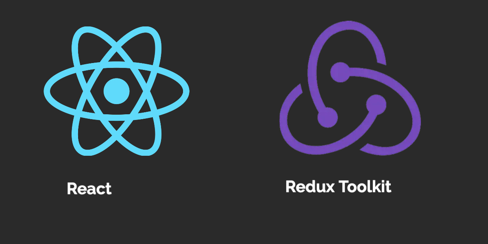

# Redux Toolkit
  <div align="center">
    
  </div>

- Redux is a global state
- Redux is not necessary for every project.
- You may need Redux if you don't want to do props drilling (passing props too deep).
- If you are still confused about Redux, just think about the React state. The only difference is you can access the state from anywhere.

```bash
  Just remember that concept "get" and "set". In Redux, we can think that "get" is a selector, and "set" is a dispatch
```

## Run Locally

Clone the project

```bash
  git clone https://github.com/adonbiju/Redux-Toolkit-.git
```

Go to the project directory

```bash
  cd Redux-Toolkit-
```

Install dependencies

```bash
  npm install
```

Start the Project

```bash
  npm  start
```
## Demo Video
  <h1 align="center">
  
</h1>